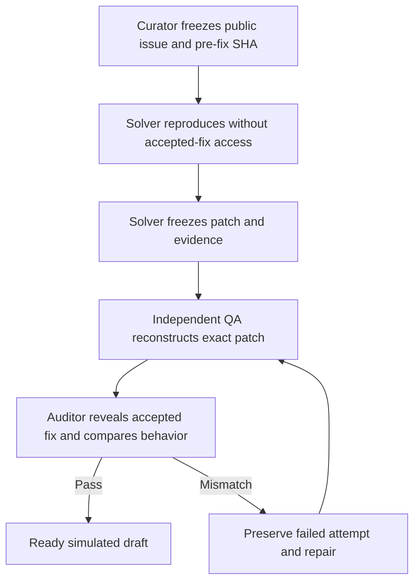

# ABH benchmark cohort 2 — owner report

> **SIMULATION / HISTORICAL REPLAY — NOT PAID WORK**

**Completed:** 2026-09-17  
**Scope:** ten public historical software problems, replayed offline from frozen pre-fix revisions  
**Public actions:** none  
**Final verdict:** **10/10 solutions independently QA-validated and accepted-fix-audited; 3 required repair after the audit caught first-pass QA false positives**

## Executive result

| Measure | Result |
| --- | ---: |
| Cases selected, set up, and reproduced | 10/10 |
| Root causes confirmed by historical audit | 10/10 |
| First-pass solutions that survived audit | 7/10 |
| First-pass QA false positives caught by audit | 3/10 |
| Failed cases repaired and revalidated | 3/3 |
| Final solutions passing fresh QA and audit | 10/10 |
| Strictly ready simulated drafts | 10/10 |
| Public submissions or payment claims | 0 |

The important result is not a cosmetic 100% first-pass score. The system exposed three genuine misses, preserved their original artifacts, repaired each one, ran fresh independent QA, and then repeated the accepted-fix comparison. The final score is 10/10; the honest first-pass audited score is 7/10.

## How the hunter chain operated

The roles were separated deliberately:

1. Curators recorded the problem, repository, frozen pre-fix revision, acceptance criteria, and later accepted-fix reference.
2. Solvers received the issue and pre-fix source, but not the accepted patch. They had to reproduce the fault, diagnose it, implement a patch, add tests, and produce a draft submission.
3. Independent QA reconstructed each solver revision from the supplied patch, verified revision identity and provenance, and ran acceptance, regression, build, lint, and type checks where applicable.
4. Only after the solver result was frozen did an auditor inspect the historical accepted fix. The auditor compared semantics and boundary behavior—not merely text—and either certified the result or required repair.
5. A repaired result had to pass a new QA review at the new exact revision and a new accepted-fix audit. The failed attempt remained in `evidence/attempt-1/`.

## Case-by-case result

| ID | Historical problem | Reproduction and solution | QA and accepted-fix audit | Final |
| --- | --- | --- | --- | --- |
| 01 | [pallets/click #3019](https://github.com/pallets/click/issues/3019) — empty/custom prompt suffix formatting | Reproduced the inserted-space behavior. The first patch removed the empty-suffix space but changed custom suffix output and final-character delegation. Repair constructed the full prompt exactly and delegated its final character consistently. | First QA passed incorrectly. Audit against [PR #3021](https://github.com/pallets/click/pull/3021) caught both boundary errors. Repaired probes matched accepted behavior across 56 prompt/confirm combinations; focused 6 passed; full suite 1,308 passed, 21 skipped, 1 xfailed; Ruff, MyPy, build, and compile passed. | **PASS after repair** |
| 02 | [python-attrs/cattrs #418](https://github.com/python-attrs/cattrs/issues/418) — `Annotated` optional union dispatch | Reproduced handler invocation with the outer `Annotated` alias and adapted dispatch to use the underlying union type consistently. | Accepted-fix behavior matched. Focused 4 passed; practical suite 441 passed, 1 skipped, 15 xfailed, with one unrelated property test excluded after identical pristine-tree failure; build and formatting passed. | **PASS first attempt** |
| 03 | [sindresorhus/ora #123](https://github.com/sindresorhus/ora/issues/123) — spinner interval not synchronized | Reproduced stale interval state. First patch used truthiness and changed named-spinner semantics. Repair updates interval only for custom spinner objects and preserves an explicit interval of `0`. | First QA passed incorrectly. Audit against [PR #125](https://github.com/sindresorhus/ora/pull/125) exposed both edge cases. Repaired AVA 26, TSD, and XO checks passed under the historical toolchain, with direct boundary probes. | **PASS after repair** |
| 04 | [sindresorhus/p-queue #168](https://github.com/sindresorhus/p-queue/issues/168) — aborted jobs leave queue accounting stuck | Reproduced same-turn abort drain failure. The first test let callbacks observe the signal and therefore masked queue ownership of cancellation. Repair races the task with a queue-owned abort promise, cleans listeners, and advances accounting in `finally`. | First QA passed incorrectly. Audit with never-settling callbacks made the first patch hang at size 1/pending 1. Repaired focused test passed; practical suite 45 passed with 2 documented baseline failures; build/typecheck passed; listener and late-rejection probes passed. | **PASS after repair** |
| 05 | [pallets/click #2819](https://github.com/pallets/click/issues/2819) — auto help collides with a user parameter named `help` | Reproduced callback binding collision and isolated the auto-added help option's internal storage name. | Behavior matched the accepted resolution for the frozen issue. Full suite 1,896 passed, 24 skipped, 1 xfailed; Ruff, MyPy, compile, and build passed. | **PASS first attempt** |
| 06 | [jaraco/inflect #131](https://github.com/jaraco/inflect/issues/131) — suffix-only ordinal raises `IndexError` | Reproduced `st`/`nd`/`rd`/`th` empty-payload failure and normalized the stripped value to zero without ordinal post-processing. | Matched [PR #137](https://github.com/jaraco/inflect/pull/137) for the accepted default-call scope. Focused regression and all 69 practical tests passed; build/compile passed. Historical optional lint/type plugins were unavailable and explicitly marked not applicable. | **PASS first attempt** |
| 07 | [yargs/yargs-parser #433](https://github.com/yargs/yargs-parser/issues/433) — option names ending in 3+ hyphens become positionals | Reproduced the parser edge case and corrected the option-matching expression. | Production change was byte-identical to [PR #434](https://github.com/yargs/yargs-parser/pull/434). CJS 357, ESM 17, and TypeScript 20 tests passed; build and lint passed. Browser suite was outside the available historical environment. | **PASS first attempt** |
| 08 | [sindresorhus/globby #177](https://github.com/sindresorhus/globby/issues/177) — `objectMode` return type is inaccurate | Reproduced incorrect string-array inference and added narrow `objectMode: true` overloads while retaining broad fallbacks. | Semantics matched [PR #178](https://github.com/sindresorhus/globby/pull/178). Runtime 119 passed with 2 known baseline failures; TSD and XO passed using documented historical compatibility pins. | **PASS first attempt** |
| 09 | [sindresorhus/escape-string-regexp #20](https://github.com/sindresorhus/escape-string-regexp/issues/20) — escaped hyphen invalid with Unicode regexp flag | Reproduced the invalid escape and emitted a hexadecimal escape for hyphen. | AVA 3/3, XO, TSD, syntax, and package checks passed. Accepted fix emits `\u002d`; solver emits `\x2d`. They are behaviorally equivalent for JavaScript RegExp, while the serialization difference is disclosed. | **PASS first attempt** |
| 10 | [sindresorhus/indent-string PR #18](https://github.com/sindresorhus/indent-string/pull/18) — negative indentation count lacks explicit validation | Reproduced the implicit `String.repeat` failure and added explicit non-negative-count validation plus a focused test. | Implementation was semantically identical to the accepted change. AVA 10/10, XO, TSD, syntax, and packaging passed. | **PASS first attempt** |

## The three false positives and their repairs

### 1. Click: output looked right in one case, but the call contract was wrong

The initial test asserted that an empty suffix did not print a space. It did not sufficiently assert custom suffix exactness or Click's deliberate practice of passing the final prompt character through the input function for readline compatibility. The accepted-fix audit caught both omissions.

**Control added:** prompt-format changes must test the complete rendered string and the echo/input call boundary, including empty, default, custom, Unicode, tab, newline, and empty-prompt cases.

### 2. Ora: truthiness is not presence

The initial patch assigned the spinner's interval with a truthy fallback. That failed for a legitimate interval of `0`, and it applied an unintended default interval when selecting a named spinner. The issue's happy path passed, but the state contract did not.

**Control added:** numeric option tests must include zero, undefined, inherited default, and custom-object versus named-reference behavior.

### 3. P-Queue: the test accidentally implemented cancellation for the queue

The initial abort test used callbacks that listened to their own abort signals. That let the callbacks settle, so the queue appeared to drain even though it did not own the cancellation lifecycle. The auditor used never-settling callbacks that ignored the signal; the queue remained stuck.

**Control added:** lifecycle tests must include an uncooperative/never-settling task, both same-turn abort orders, a pre-aborted queued task, listener removal, queue drain, following work, and late rejection handling.

## Evidence integrity

- Each case contains an intake, issue brief, reproduction proof, solution explanation, patch, result record, command log, independent QA record, accepted-fix audit, and draft submission.
- Every active QA and audit names the exact solver revision it reviewed.
- Solver and reviewer identities are distinct.
- Jobs 01, 03, and 04 retain their failed first attempts—including the original QA pass and later audit failure—under `evidence/attempt-1/`.
- The generated scorecard refuses strict-ready status when QA is stale, non-independent, missing required checks, or when the audit does not match the current revision.
- `proofSeconds` and `solveSeconds` remain `null`: the cohort did not have trustworthy automated duration capture, so no time claims were invented.

## Limitations

- These are historical replays, not newly claimed bounties and not proof of payment-market performance.
- Execution was limited to Python and Node projects available in the environment; complete upstream OS/interpreter matrices were not reproduced.
- Several historical JavaScript repositories required era-compatible Node versions or installation-only type packages. Those accommodations and baseline failures are recorded per job.
- Accepted-fix equivalence is scoped to the frozen issue acceptance criteria. Some solver patches omit documentation/changelog polish or differ in harmless public shape; those differences are disclosed in their audits.
- No public issue comments, pull requests, claims, or submissions were made.

## Owner conclusion

This cohort demonstrates the complete ABH chain from discovery through reproduction, solution, independent QA, accepted-fix audit, repair, and report. It also demonstrates why the final historical audit is necessary: ordinary QA approved three incomplete first patches. With the audit gate and repair loop active, all ten cases reached evidence-backed final readiness. Without that gate, the honest result would have been 7/10, not 10/10.
